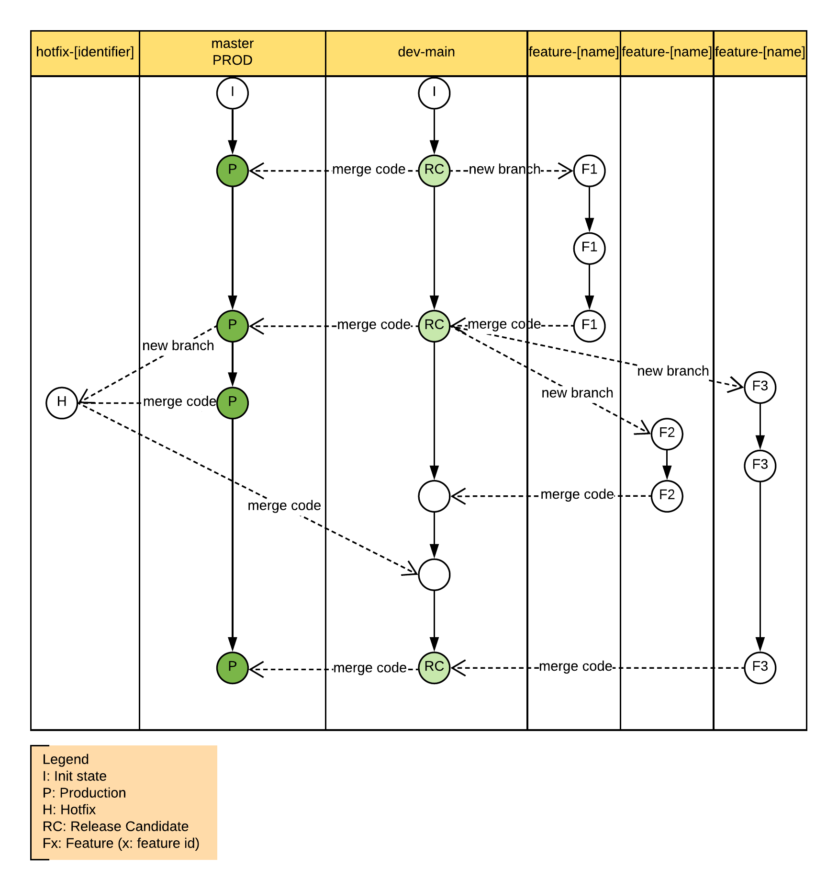
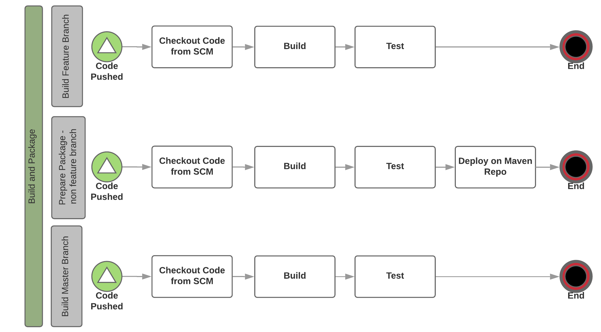
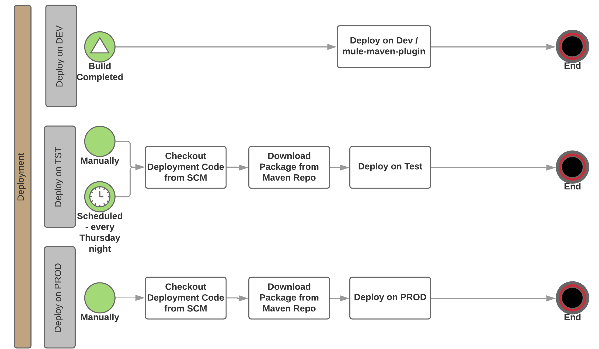

# CICD Hello World

**Automated build ready for self-service**

Project demonstrates DevOps best prectices, tooling and configuration and is mostly focused on CI.

**Key topics are:**

* Maven configuration
	* (Internal) Maven Repository Configuration: `Nexus` has been used for the purposes of this document
	* [Maven scm plugin](https://maven.apache.org/scm/maven-scm-plugin/)
* [MUnit](https://docs.mulesoft.com/munit/v/1.3/)
* Source code branching
* CI pipeline - design and build: `Jenkins` has been used to demostrate implementation of the proposed design
* Prepare a release
	* [Maven release plugin](http://maven.apache.org/maven-release/maven-release-plugin/)

## Maven repository `Nexus`
Why is it important:
* security
* manages all the dependencies (external libraries as well as internally built libraries like)
* manages and stores built packages - snapshots and releases

#### Repository mirroring

[Maven Repostiory Mirroring](https://maven.apache.org/guides/mini/guide-mirror-settings.html)

[Nexus Repository Mirroring](https://help.sonatype.com/display/NXRM2/Apache+Maven)

<details><summary>Sample Config in `settings.xml`</summary><p>
	
```xml
<mirrors>
<!-- maven central repository -->	
    <mirror>
      <id>mvn_repo_central_mirror</id>
      <mirrorOf>central</mirrorOf>
      <url>${MVNREPO_URL}/repository/${MVNREPO_CENTRAL}</url>
    </mirror>

<!-- MuleSoft public repository -->
    <mirror>
      <id>mule_repo_public_mirror</id>
      <mirrorOf>mule-public</mirrorOf>
      <url>${MVNREPO_URL}/repository/${MVNREPO_MULE_PUBLIC}</url>
    </mirror>
 
<!-- MuleSoft enterprise repository - credentials are required (provided by MuleSoft support team) -->	
    <mirror>
      <id>mule_repo_ee_mirror</id>
      <mirrorOf>mule-ee</mirrorOf>
      <url>${MVNREPO_URL}/repository/${MVNREPO_MULE_EE}</url>
    </mirror>
  </mirrors>
<mirrors>
```

</p></details>

#### Deploy package to Nexus
Section provides the details on configuration that is required to enable deployment of a package to Mave repository (e.g. `Nexus`).

<details><summary>Sample Config in pom.xml</summary><p>
	
```xml
<distributionManagement>
	<repository>
		<id>nexus</id>
		<name>Releases</name>
		<url>${MVNREPO_URL}/repository/${maven.repo.releases}</url>
	</repository>
	<snapshotRepository>
		<id>nexus</id>
		<name>Snapshot</name>
		<url>${MVNREPO_URL}/repository/${maven.repo.snapshots}</url>
	</snapshotRepository>
</distributionManagement>
```

</p></details>
<p></p>

`${MVNREPO_URL}` is configured as Jenkins variable, see [Jenkins configuration](#jenkins-configuration) for more details.

`${maven.repo.releases}`, and `${maven.repo.snapshots}` are configured in pom as maven properties:

<details><summary>Sample - properties</summary><p>
	
```xml
<properties>
	<maven.repo.snapshots>maven-snapshots</maven.repo.snapshots>
	<maven.repo.releases>maven-releases</maven.repo.releases>
</properties>
```

</p></details>
<p></p>

Once the configuration is done you can test your deployment to mavne repository (e.g. Nexus) by running the command `mvn clean deploy`. If command was executed successfully new package should be visible in Nexus (either under snapshots or under releases, depending on the project version, e.g. `<version>1.0.6-SNAPSHOT</version>` would create a pacakge under snapshots).

## MUnit

Chapter describes recommended best practices for automated unit testing. 

* Test coverage must be at least 80% (that includes application coverage and individual flow coverage).
* Build should be configured to fail if percetage of test coverage is not sufficient.
* Report generated as a result of the unit test should be archived on CI Server for future reference.

<details><summary>Sample Config</summary><p>
	
```xml
<plugin>
  <groupId>com.mulesoft.munit.tools</groupId>
  <artifactId>munit-maven-plugin</artifactId>
  <version>${munit.version}</version>
  <executions>
    <execution>
      <id>test</id>
      <phase>test</phase>
      <goals>
        <goal>test</goal>
      </goals>
    </execution>
  </executions>
  <configuration>
    <coverage>
      <runCoverage>true</runCoverage>
      <failBuild>true</failBuild>
      <requiredApplicationCoverage>80</requiredApplicationCoverage>
      <requiredFlowCoverage>80</requiredFlowCoverage>
      <formats>
        <format>html</format>
        <format>json</format>
      </formats>
    </coverage>
  </configuration>
</plugin>
```

</p></details>

## Source code branching

The diagram below captures the suggested branching strategy, which also impacts the design of CI pipelines.



* **Feature branch**: feature development - branch usually maintained by one developer working on the specific feature.
* **Main development branch**: all the finalised features are merged to development branch. The new releases or release candidates are created from this branch.
* **Prod branch**: Once the release is deployed to production, code from development branch is merged to Master that represents production code.
* **Hotfix branch**: Created from Mater / PROD branch if critical issue is identified in production and requires immediate fix.

## CICD Pipeline design

The main focus of this document is to provide detailed view on CI pipeline definition. CD pipelines are mentioned mostly to maintain completed DevOps picture.

**Continuous Integration**



As displayed on the diagram above, package creation and deployment (**to Nexus and DEV environment**) is triggered only for development branch (name starts with 'dev-').
Feature branch and PROD branch do not create any packages, neither do deployment. The only purpose of these pipelines is to run the MUnit tests to ensure code quality.

**Continuous Deployment**



Deployment on DEV is the only deployment considered and implemented in this example. Deployment on development environment should be triggered every time there is a commit to development brach (as per the configuration in `Jenkinsfile`, every branch starting with 'dev-' is considered as development branch). [Mule maven plugin](https://docs.mulesoft.com/mule-user-guide/v/3.9/mule-maven-plugin) is used for deployement to development environment.

<details><summary>Sample DEV deployment config - on-prem runtime</summary><p>
	
```xml
<plugin>
  <groupId>org.mule.tools.maven</groupId>
  <artifactId>mule-maven-plugin</artifactId>
  <version>2.2.1</version>
  <configuration>
    <deploymentType>arm</deploymentType>
    <username>${MULEANYPOINT_USER}</username>
    <password>${MULEANYPOINT_PASSWORD}</password>
    <target>summer</target>
    <!-- One of: server, serverGroup, cluster -->
    <targetType>server</targetType>
    <environment>TEST</environment>
  </configuration>
  <executions>
    <execution>
      <id>deploy</id>
      <phase>deploy</phase>
      <goals>
        <goal>deploy</goal>
      </goals>
    </execution>
  </executions>
</plugin>
```

</p></details>
<p></p>

`${MULEANYPOINT_USER}` and `${MULEANYPOINT_PASSWORD}` are configured as Jenkins Credentials, see [Jenkins configuration](#jenkins-configuration) for more details. 

Special technical user should be created with specific permission to deploy applications. Production should have the separate deployment user, so user used for deployment to other environments can't be abused for PROD deployment.

Deployment on TEST and PROD are included just for illustration purposes. There are different tools and approaches that could help with the application deployment. Some of them are mentioned in [Recommendations section](#recommendations).

### Pipeline as a Code

Pipeline defined in `Jenkinsfile` implements different stages of the build process depending on the source code branch that triggered the build execution as desribed in [parent section](#cicd-pipeline-design).

#### Benefits of Pipeline

- Code: Pipelines are implemented in code and typically checked into source control, giving teams the ability to edit, review, and iterate upon their delivery pipeline.
- Durable: Pipelines can survive both planned and unplanned restarts of CI server
- Pausable: Pipelines can optionally stop and wait for human input or approval before continuing the Pipeline run.
- Versatile: Pipelines support complex real-world continuous delivery requirements, including the ability to fork/join, loop, and perform work in parallel.

### Jenkins configuration
* Credentials
  * MULEANYPOINT_USR
  * MULEANYPOINT_PASSWORD
  * SCM_USER
  * SCM_PASSWORD
* `settings.xml` for Jenkins

## Release management
Releases are prepared by [Maven release plugin](http://maven.apache.org/maven-release/maven-release-plugin/) against the **dev-main** branch.

<details><summary>Sample Config - pom.xml</summary><p>
	
```xml
<scm>
	<developerConnection>scm:git:https://${SCM_USER}@github.com/mulesoft-consulting/cicd_build_hello_world.git</developerConnection>
	<tag>HEAD</tag>
</scm>
<build>
	<plugins>
		<plugin>
			<groupId>org.apache.maven.plugins</groupId>
			<artifactId>maven-release-plugin</artifactId>
			<version>2.5.3</version>
			<configuration>
				<checkModificationExcludes>
					<checkModificationExclude>pom.xml</checkModificationExclude>
				</checkModificationExcludes>
			</configuration>
		</plugin>
	
		<plugin>
			<artifactId>maven-scm-plugin</artifactId>
			<version>1.9.5</version>
			<configuration>
				<tag>${project.artifactId}-${project.version}</tag>
				<username>${SCM_USER}</username>
				<password>${SCM_PASSWORD}</password>
			</configuration>
		</plugin>
	</plugins>
</build>
```

</p></details>
<p></p>

The plugin **maven-scm-plugin** is required to ensure that -SNAPSHOT is removed from release version and proper tag is created and committed to repository.

`${SCM_USER}` and `${SCM_PASSWORD}` are configured as Jenkins Credentials, see [Jenkins configuration](#jenkins-configuration) for more details. 

To enable maven release plugin to commit changes to repository following configuration must be included in maven's `settings.xml` file.


<details><summary>Sample Config - settings.xml</summary><p>
	
```xml
<server>
	<id>github.com</id>
	<username>${SCM_USER}</username>
	<password>${SCM_PASSWORD}</password>
</server>
```

</p></details>

## How to use `cicd-hello-world`
This project implements all patterns discussed above. It gives us the ability to quickly test and prove design decisions and configuration.

## Recommendations
Check the following [project](https://github.com/mulesoft-consulting/automated_api_promotion) for establishing simple CD within the organisation.

